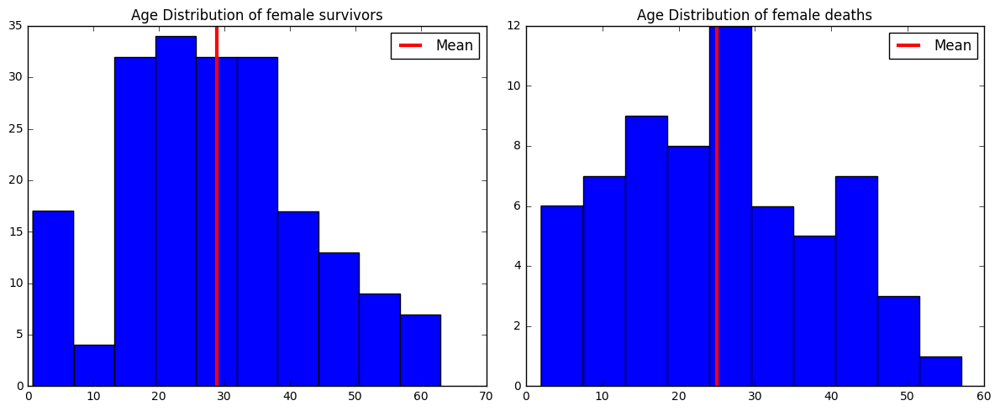
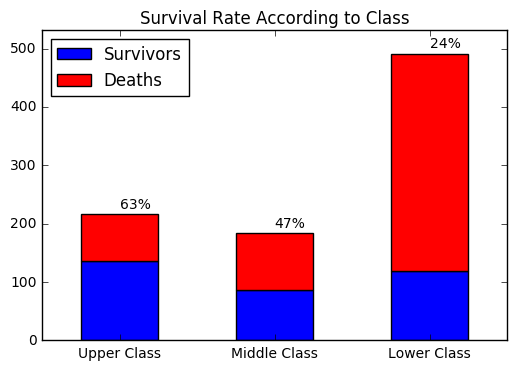

# Analysis of the Titanic Data

```python
import numpy as np
import pandas as pd
from sklearn.preprocessing import Imputer
import matplotlib.pyplot as plt
```


```python
df_train = pd.read_csv('./train.csv')
df_test = pd.read_csv('./test.csv')
```


```python
df_train.info()
```

    <class 'pandas.core.frame.DataFrame'>
    RangeIndex: 891 entries, 0 to 890
    Data columns (total 12 columns):
    PassengerId    891 non-null int64
    Survived       891 non-null int64
    Pclass         891 non-null int64
    Name           891 non-null object
    Sex            891 non-null object
    Age            714 non-null float64
    SibSp          891 non-null int64
    Parch          891 non-null int64
    Ticket         891 non-null object
    Fare           891 non-null float64
    Cabin          204 non-null object
    Embarked       889 non-null object
    dtypes: float64(2), int64(5), object(5)
    memory usage: 83.6+ KB


```python
df_train.describe()
```

    /Users/ahmetcanozbek/anaconda/envs/qs/lib/python2.7/site-packages/numpy/lib/function_base.py:3834: RuntimeWarning: Invalid value encountered in percentile
      RuntimeWarning)


<div>
<table border="1" class="dataframe">
  <thead>
    <tr style="text-align: right;">
      <th></th>
      <th>PassengerId</th>
      <th>Survived</th>
      <th>Pclass</th>
      <th>Age</th>
      <th>SibSp</th>
      <th>Parch</th>
      <th>Fare</th>
    </tr>
  </thead>
  <tbody>
    <tr>
      <th>count</th>
      <td>891.000000</td>
      <td>891.000000</td>
      <td>891.000000</td>
      <td>714.000000</td>
      <td>891.000000</td>
      <td>891.000000</td>
      <td>891.000000</td>
    </tr>
    <tr>
      <th>mean</th>
      <td>446.000000</td>
      <td>0.383838</td>
      <td>2.308642</td>
      <td>29.699118</td>
      <td>0.523008</td>
      <td>0.381594</td>
      <td>32.204208</td>
    </tr>
    <tr>
      <th>std</th>
      <td>257.353842</td>
      <td>0.486592</td>
      <td>0.836071</td>
      <td>14.526497</td>
      <td>1.102743</td>
      <td>0.806057</td>
      <td>49.693429</td>
    </tr>
    <tr>
      <th>min</th>
      <td>1.000000</td>
      <td>0.000000</td>
      <td>1.000000</td>
      <td>0.420000</td>
      <td>0.000000</td>
      <td>0.000000</td>
      <td>0.000000</td>
    </tr>
    <tr>
      <th>25%</th>
      <td>223.500000</td>
      <td>0.000000</td>
      <td>2.000000</td>
      <td>NaN</td>
      <td>0.000000</td>
      <td>0.000000</td>
      <td>7.910400</td>
    </tr>
    <tr>
      <th>50%</th>
      <td>446.000000</td>
      <td>0.000000</td>
      <td>3.000000</td>
      <td>NaN</td>
      <td>0.000000</td>
      <td>0.000000</td>
      <td>14.454200</td>
    </tr>
    <tr>
      <th>75%</th>
      <td>668.500000</td>
      <td>1.000000</td>
      <td>3.000000</td>
      <td>NaN</td>
      <td>1.000000</td>
      <td>0.000000</td>
      <td>31.000000</td>
    </tr>
    <tr>
      <th>max</th>
      <td>891.000000</td>
      <td>1.000000</td>
      <td>3.000000</td>
      <td>80.000000</td>
      <td>8.000000</td>
      <td>6.000000</td>
      <td>512.329200</td>
    </tr>
  </tbody>
</table>
</div>


## Gender


```python
# Let's look at genders
n_male = (df_train['Sex'] == 'male').sum()
n_female = (df_train['Sex'] == 'female').sum()
```


```python
n_male_survivors = ((df_train['Survived'] == 1) & (df_train['Sex'] == 'male')).sum()
n_female_survivors = ((df_train['Survived'] == 1) & (df_train['Sex'] == 'female')).sum()
print 'n_male_survivors:', n_male_survivors
print 'n_female_survivors:', n_female_survivors
```

    n_male_survivors: 109
    n_female_survivors: 233


```python
# Plot
ind = np.arange(2)
width = 0.8
bar_data = (n_male_survivors, n_female_survivors)
bar_data_2 = (n_male - n_male_survivors, n_female - n_female_survivors)
plt.bar(ind, bar_data, color='b', width=width)
plt.bar(ind, bar_data_2, bottom= bar_data, color='r', width=width)
plt.xticks((ind + width/2),('Male','Female'))
plt.legend(('Survivded','Not Survived'))
plt.ylabel('Number of People')
plt.ylim([0,650])
r_male_survivors = n_male_survivors / float(n_male)
r_female_survivors = n_female_survivors / float(n_female)
plt.text(ind[0] + width/2, bar_data[0] + bar_data_2[0] + 10, str(int(round(r_male_survivors * 100))) + '%')
plt.text(ind[1] + width/2, bar_data[1] + bar_data_2[1] + 10, str(int(round(r_female_survivors * 100))) + '%')
plt.show()
```


## Female Gender and Age
I will analyze the age distribution of the females by survived or not survived


```python
df_train.info()
```

    <class 'pandas.core.frame.DataFrame'>
    RangeIndex: 891 entries, 0 to 890
    Data columns (total 12 columns):
    PassengerId    891 non-null int64
    Survived       891 non-null int64
    Pclass         891 non-null int64
    Name           891 non-null object
    Sex            891 non-null object
    Age            714 non-null float64
    SibSp          891 non-null int64
    Parch          891 non-null int64
    Ticket         891 non-null object
    Fare           891 non-null float64
    Cabin          204 non-null object
    Embarked       889 non-null object
    dtypes: float64(2), int64(5), object(5)
    memory usage: 83.6+ KB


It looks like we have some missing data in the age column, we should fix that before moving on


```python
female_age_survived = df_train[(df_train['Sex'] == 'female') & (df_train['Survived'] == 1)]['Age']
female_age_not_survived = df_train[(df_train['Sex'] == 'female') & (df_train['Survived'] == 0)]['Age']
# Drop NaNs
female_age_survived =  female_age_survived.dropna()
female_age_not_survived = female_age_not_survived.dropna()
```


```python
# Plot
fig = plt.figure()
fig.set_size_inches(12,5)
plt.subplot(1,2,1); plt.hist(female_age_survived); plt.title('Age Distribution of female survivors')
plt.axvline(x=female_age_survived.mean(), color='red', linewidth=3);
plt.legend(('Mean',))

plt.subplot(1,2,2); plt.hist(female_age_not_survived); plt.title('Age Distribution of female deaths')
plt.axvline(x=female_age_not_survived.mean(), color='red', linewidth=3);
plt.legend(('Mean',))

plt.tight_layout()
plt.show()
```





## Survival Rate Based on Socio-Economic Status (Pclass)


```python
p_class = df_train['Pclass'].value_counts()
p_class_survivors = df_train[df_train['Survived'] == 1]['Pclass'].value_counts()
p_class_deaths = p_class - p_class_survivors

p_class = p_class.sort_index()
p_class_survivors = p_class_survivors.sort_index()
p_class_deaths = p_class_deaths.sort_index()

p_class = p_class.rename({1:'Upper Class', 2:'Middle Class', 3:'Lower Class'})
p_class_survivors = p_class_survivors.rename({1:'Upper Class', 2:'Middle Class', 3:'Lower Class'})
p_class_deaths = p_class_deaths.rename({1:'Upper Class', 2:'Middle Class', 3:'Lower Class'})
```


```python
# Plot
p_class_survivors.plot(kind='bar', color='blue')
p_class_deaths.plot(kind='bar', color='red', bottom=p_class_survivors, rot=0)
plt.legend(['Survivors', 'Deaths'], loc='best')

rate_upper_survivor = int(round((p_class_survivors['Upper Class'] / float(p_class['Upper Class'])) * 100))
rate_middle_survivor = int(round((p_class_survivors['Middle Class'] / float(p_class['Middle Class'])) * 100))
rate_lower_survivor = int(round((p_class_survivors['Lower Class'] / float(p_class['Lower Class'])) * 100))

plt.text(0, p_class['Upper Class'] + 10, str(rate_upper_survivor) + '%')
plt.text(1, p_class['Middle Class'] + 10, str(rate_middle_survivor) + '%')
plt.text(2, p_class['Lower Class'] + 10, str(rate_lower_survivor) + '%')
plt.ylim([0, np.max(p_class) + 40])
plt.title('Survival Rate According to Class')

plt.show()
```





# Classification


```python
# Dropping 'Cabin', 'Ticket', 'Name' columns
df_train = df_train.drop(['Cabin','Ticket', 'Name', 'Embarked'], axis=1)
df_test = df_test.drop(['Cabin', 'Ticket', 'Name', 'Embarked'], axis=1)

# Impute 'Age'
df_train['Age'].fillna(df_train['Age'].mean(), inplace=True)
df_test['Age'].fillna(df_test['Age'].mean(), inplace=True)
# Impute 'Fare' on test set
df_test['Fare'].fillna(df_test['Fare'].mean(), inplace=True)

# One-hot encodings
# Sex
df_train = pd.concat([df_train.drop(['Sex'], axis=1), pd.get_dummies(df_train['Sex'])], axis=1)
df_test = pd.concat([df_test.drop(['Sex'], axis=1), pd.get_dummies(df_test['Sex'])], axis=1)
# Pclass
df_train = pd.concat([df_train.drop(['Pclass'], axis=1), pd.get_dummies(df_train['Pclass'])], axis=1)
df_test = pd.concat([df_test.drop(['Pclass'], axis=1), pd.get_dummies(df_test['Pclass'])], axis=1)
```


```python
# Classification
y_train = df_train['Survived']
X_train = df_train.drop(['Survived'], axis=1)
X_test = df_test

from sklearn.ensemble import RandomForestClassifier
rf_model = RandomForestClassifier()
rf_model.fit(X_train, y_train)
y_train_pred = rf_model.predict(X_train)
print 'Train Accuracy:', np.sum(y_train == y_train_pred) / float(len(y_train))

y_test_pred = rf_model.predict(X_test)
```

    Train Accuracy: 0.986531986532


```python
submission_df = pd.DataFrame()
submission_df['PassengerId'] = df_test['PassengerId']
submission_df['Survived'] = y_test_pred

submission_df.to_csv('titanic_submission.csv', index=False)
```
